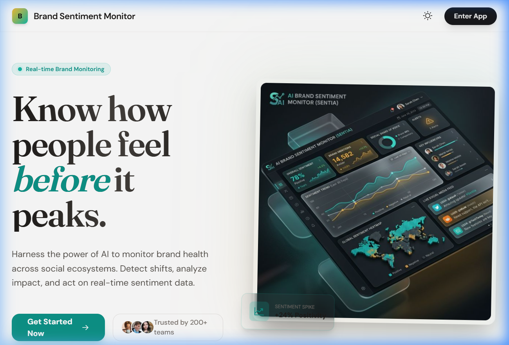
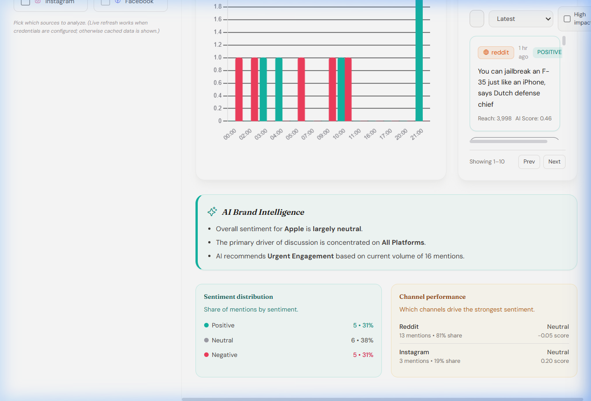

# 🚀 Brand Sentiment Monitor — AI-Powered SaaS Dashboard

[](https://github.com/shagunchaudhary19/Sentiment-Analysis-for-Brand-Monitoring/blob/main/LICENSE)
[](https://github.com/shagunchaudhary19/Sentiment-Analysis-for-Brand-Monitoring/issues)

A premium, state-of-the-art **Brand Sentiment Analysis** platform designed for modern marketing teams. Monitor brand health in real-time across YouTube, Reddit, Instagram, and Facebook using advanced AI insights and human-centric design.



---

## ✨ Features

### 🧠 AI Brand Intelligence
Go beyond simple numbers. Our **AI Intelligence Panel** summarizes exactly *what* people are saying and *how* to respond.
- **Dynamic Summarization**: Automated insight bullets based on live sentiment volume.
- **Strategic Recommendations**: AI-driven advice for engagement or amplification.

### 🌓 Premium Dual-Mode UI
- **Pure White Mode**: A high-end, clean aesthetic for daylight professional work.
- **Midnight Dark Mode**: A sleek, high-contrast dark theme for deep focus and monitoring.
- **Glassmorphism & Micro-animations**: Smooth transitions, shimmering skeletons, and modern gradients.

### 📊 Advanced Analytics
- **Multi-Brand Support**: Seamlessly switch between Apple, Samsung, Google, and more.
- **Competitive Mode**: Side-by-side benchmarking (A vs. B) to track market share.
- **Trend Charts**: Interactive `Chart.js` visualizations for positive vs. negative sentiment flow.
- **High-Impact Mention Feed**: Real-time triage of the most influential posts.

---

## 🛠️ Tech Stack

- **Frontend**: Vanilla JS (ES6+), Tailwind CSS (3.x), Phosphor Icons, Chart.js.
- **Backend**: Node.js (Express), SQLite3 (Persistence), axios.
- **Data Pipeline**: Python 3.11, Pandas, VADER Sentiment, KeyBERT, spaCy.

---

## 🚀 Getting Started

### 1. Prerequisites
- [Node.js](https://nodejs.org/) (v18+)
- [Python](https://www.python.org/) (v3.10+)

### 2. Installation & Setup
```bash
# Clone the repository
git clone https://github.com/shagunchaudhary19/Sentiment-Analysis-for-Brand-Monitoring.git
cd Sentiment-Analysis-for-Brand-Monitoring

# Install dependencies
npm install
pip install -r requirements.txt
```

### 3. Initialize the Database
```bash
python init_db.py
```

### 4. Run the Platform
```bash
# Start the Backend & Server
npm run start
```
Open **`http://localhost:4001`** to see the landing page. Navigation to `/dashboard` is handled automatically.

---

## 📸 Dashboard Preview



---

## 🗺️ Roadmap
- [x] **Phase 1**: SQLite Migration for scalable data storage.
- [x] **Phase 2**: AI Insights Panel integration.
- [ ] **Phase 3**: Automated Email/Slack alerting system.
- [ ] **Phase 4**: Expanded support for TikTok and LinkedIn via Official Graph APIs.

---

## 🤝 Contributing
Contributions are what make the open source community such an amazing place to learn, inspire, and create. Any contributions you make are **greatly appreciated**.

1. Fork the Project
2. Create your Feature Branch (`git checkout -b feature/AmazingFeature`)
3. Commit your Changes (`git commit -m 'Add some AmazingFeature'`)
4. Push to the Branch (`git push origin feature/AmazingFeature`)
5. Open a Pull Request

---

## ⚖️ License
Distributed under the MIT License. See `LICENSE` for more information.

---
Created with ❤️ by [Shagun Chaudhary](https://github.com/shagunchaudhary19)
